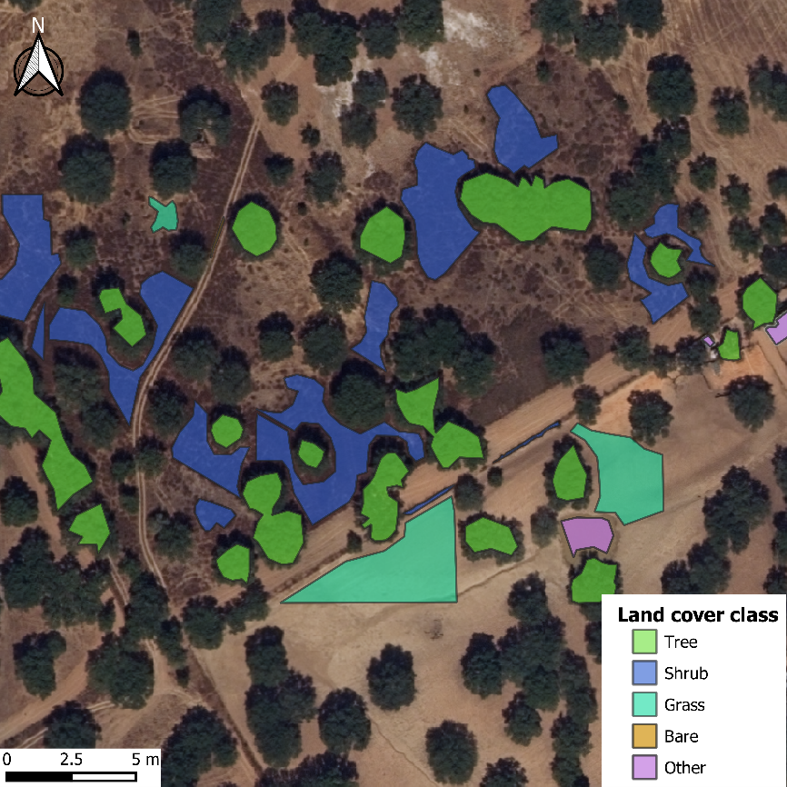
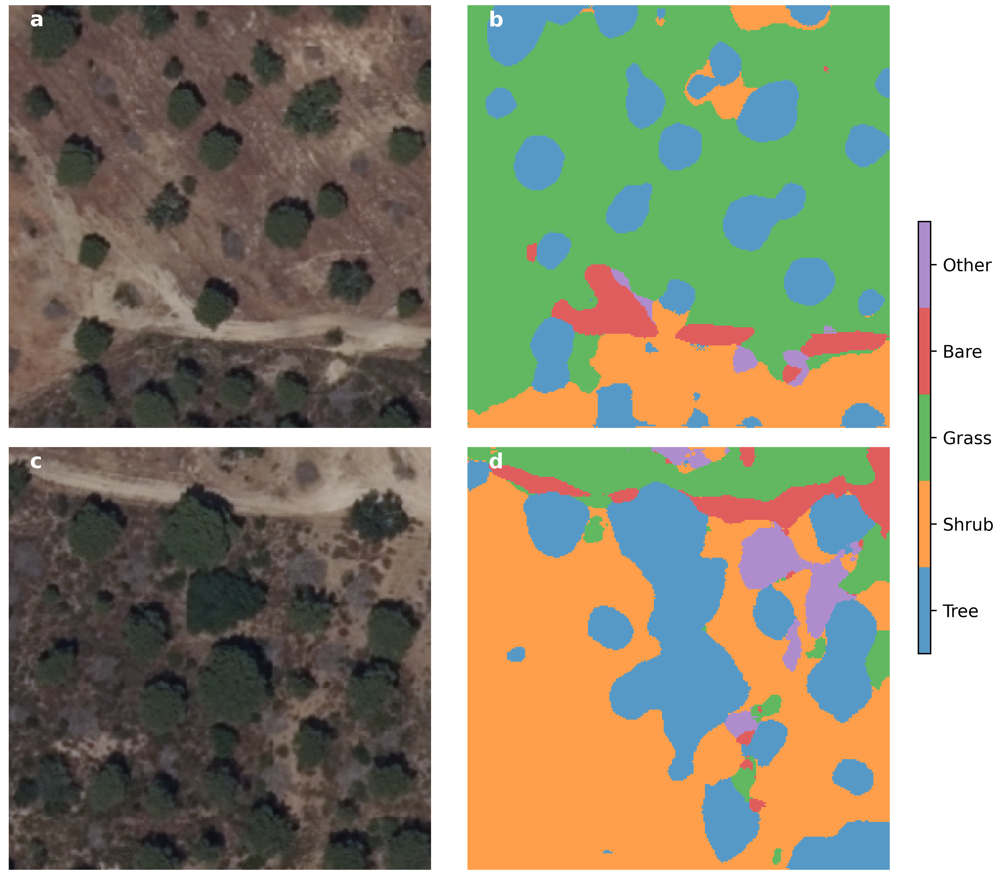

# Montado_segmentation

© Copyright 2023 Tiago Morais

This repository includes the algorithm (U-net) that was developed to ortophotomap sgemnation of Montado ecosystem. 

Used scripts are in folder "train_models". The model with the highest performance is the model 2 (number of filters = 8, Dropout rate = 0.05; Batxh size = 32).

# Example of application labeled data

# Example of application of the models

# Reference
- orais, T.G.; Domingos, T.; Teixeira, R.F.M. Semantic Segmentation of Portuguese Agri-Forestry Using High-Resolution Orthophotos. Agronomy 2023, 13, 2741. https://doi.org/10.3390/agronomy13112741
